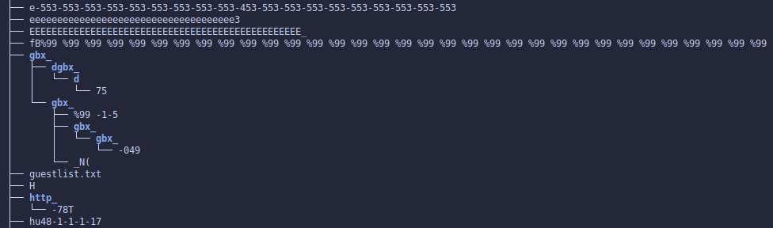

# Trackmania nations forever fuzzer

This repository is accompanied by two blog posts, so for more information I'd recommend you read those first:
1. [Hacking TMNF: Part 1 - Fuzzing the game server](https://blog.bricked.tech/posts/tmnf/part1/)
2. [Hacking TMNF: Part 2 - Exploiting a blind format string ](https://blog.bricked.tech/posts/tmnf/part2/)

# Fuzzer
## Requirements
1. You need to be able to build `libafl_qemu`, so besides Rust, you also need the following packages (assuming apt)  
```
sudo apt-get install -y build-essential python3-dev automake cmake git flex bison libglib2.0-dev libpixman-1-dev python3-setuptools cargo libgtk-3-dev ninja-build
```
2. You need to be able to build `nautilus`, which requires nightly rust. The latest version doesn't seem fully compatible with LibAFL at time of writing (?). I used version 1.65.0-nightly, which you can install using rustup:
```
rustup install nightly-2022-08-16
rustup default nightly-2022-08-16
```

## Setup
1. Download and extract the Trackmania server in the "Server" directory in the repository.
1. Ensure that the user that will be running the fuzzer does not have permission to create new files here. You _will_ have a bad time if you don't do this, as RPC calls can legitimately create new files.  



If Qemu is giving you trouble on startup, you may need to run the server in `qemu-user` once with "normal" file permissions first, before removing write/create permissions again.

## Running
1. execute the "run.sh" script from within "./GrammarFuzzer"
1. wait for the server to initialize and run `python3 kick.py` to send the initial RPC message

## Triaging
1. execute the "repro.sh" script from within "./GrammarFuzzer" to get the raw XML files that caused a crash.
1. You can send these payloads to a server using the included `throw.py` script.


## Crashes
Some example crash files are [included in this repository](./ExampleCrashes).
